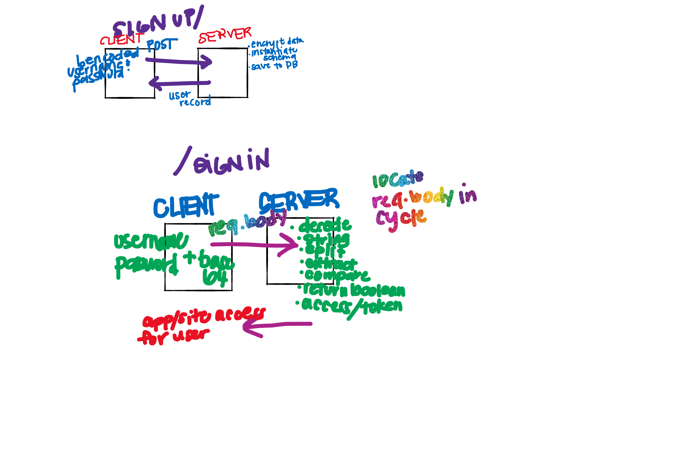

# basic-auth
This application does a basic authentication of a newly created user as well as signin for returning users using a middleware method that uses bcrypt to compare hashed passwords that are stored in the database and string entered by user. 

**TECHNOLOGY NEEDED**
Node.js, Express, Mongoose, Jest, bcrypt, base-64, cors

**INSTALL & SET UP**

-install dependencies

-create .env file

-launch localhost

**TESTING**

Navigate into the repo on your local machine and `npm run test`

